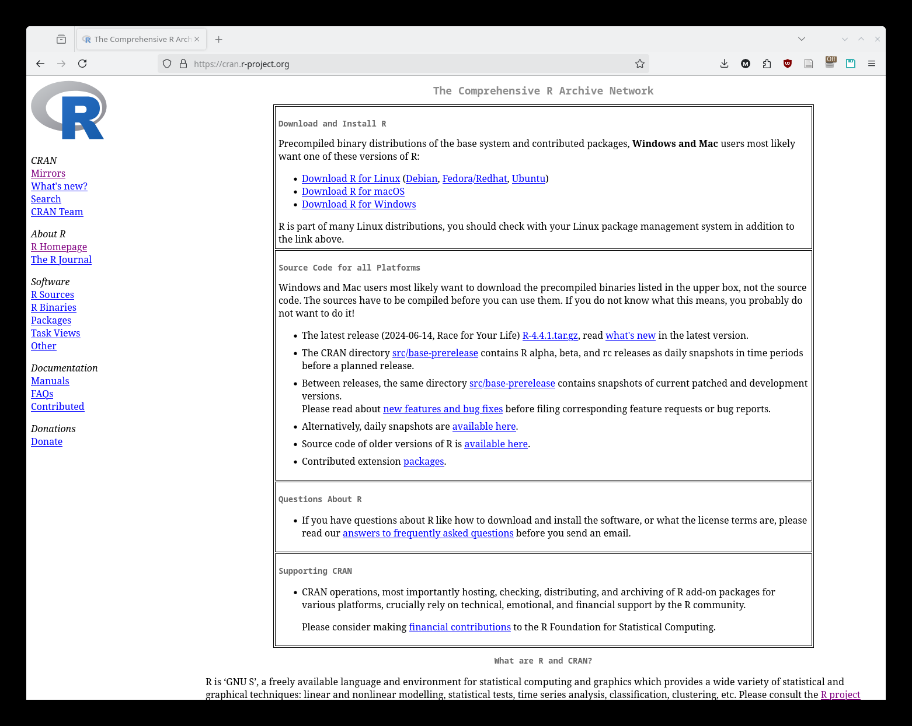
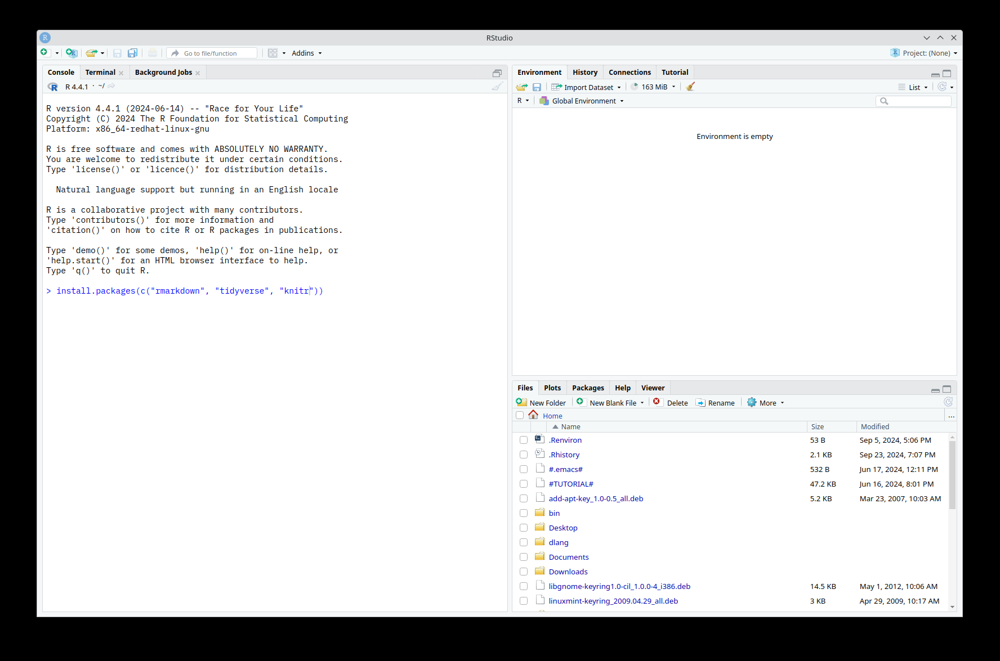
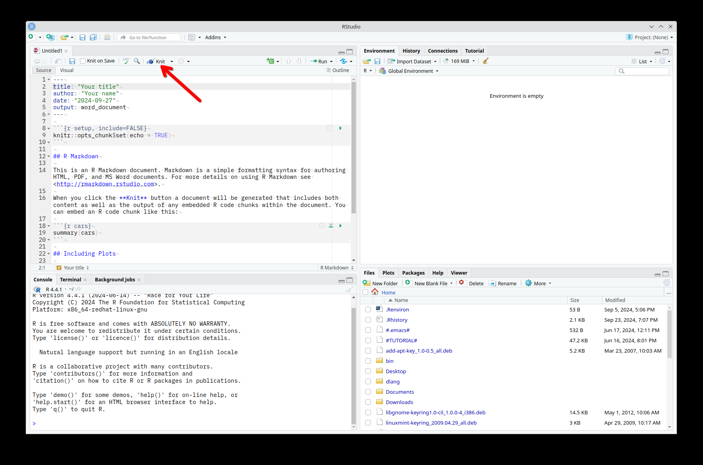

## 1. Download and Install R

Go to the CRAN R Project website: <https://cran.r-project.org/>.



### Windows

- Click on `Download R for Windows`.
- Choose `base`, then click the current Windows installer listed on the page.
- Once downloaded, open the installer and follow the prompts to complete the installation.

### macOS

- Click on `Download R for macOS`.
- Select the latest release for your version of macOS and download the installer.
- Open the `.pkg` file and follow the installation instructions.

### Linux

- Click on `Download R for Linux`.
- Choose your Linux distribution and follow the instructions on the page.

## 2. Download and Install RStudio

- Go to the Posit RStudio download page: <https://posit.co/download/rstudio-desktop/>.
- Choose the appropriate version for your operating system.
- Download and run the installer, then follow the prompts to install RStudio.

## 3. Open RStudio

- After installing both R and RStudio, open RStudio on your computer.
- Install the necessary packages by typing the following command in the RStudio Console:

```r
install.packages(c("rmarkdown", "tidyverse", "knitr"))
```



## 4. Use Posit Cloud if Local RStudio Is Not Working

If your computer is struggling to run `RStudio`, or if the installation process is taking longer than expected, you can use Posit Cloud in a web browser as a backup. Posit describes this as a browser-based way to use the RStudio IDE without installing it locally.

- Go to <https://posit.cloud/>.
- Create a free account using your `ucdavis.edu` email, or log in if you already have one.
- Open `Your Workspace`.
- Click `New Project`, then choose `New RStudio Project`.
- Wait for the project to finish loading in your browser.

Once the project opens, you can use the Console just like you would in desktop RStudio. Install the same course packages there:

```r
install.packages(c("rmarkdown", "tidyverse", "knitr"))
```

Then check that the packages load successfully:

```r
library(rmarkdown)
library(tidyverse)
library(knitr)
```

Posit Cloud is a good short-term fallback if:

- R or RStudio will not install on your computer.
- RStudio opens but crashes or freezes repeatedly.
- Your operating system or permissions are getting in the way of setup.
- You need to start the course work right away while troubleshooting a local install later.

## 5. Check Package Installation

Load each package with the `library()` function. Type these one line at a time in the console and press `Enter`.

```r
library(rmarkdown)
library(tidyverse)
library(knitr)
```

## 6. Open the Assignment

Please download the assignment called `Unit_0-setup.qmd` and start working there.

- Open `Unit_0-setup.qmd` in `RStudio` or `Posit Cloud`.
- Read the instructions in the file.
- Make your edits directly in that document.

For this course, you will be working with Quarto documents using the `.qmd` format. This assignment is designed to help you practice the exact workflow you will use later in the course.

> If you are feeling adventurous and want to render to `PDF`, you can do that too, but PDF rendering usually requires installing a LaTeX engine. Quarto recommends `TinyTeX` for this purpose. PDF is optional; HTML is the standard submission format for getting started.

## 7. Render the Document

- Click the `Render` button to create the output document.
- Wait for the rendered HTML file to open.
- If you made any edits first, save the file before rendering.



## 8. Confirm the Output Opens

A rendered HTML version of `Unit_0-setup.qmd` should appear after rendering. At that point, your setup is working well enough to continue with course materials.

## Quick Setup Checklist

- `R` is installed and opens successfully.
- `RStudio` is installed and opens successfully.
- Or, if local setup is not working yet, `Posit Cloud` opens successfully in your browser.
- `install.packages()` runs successfully.
- `library(rmarkdown)`, `library(tidyverse)`, and `library(knitr)` load without errors.
- You can open and render `Unit_0-setup.qmd` as an `HTML` document.
- Optional: you can render to `PDF` if you choose to install the extra LaTeX tooling needed for PDF output.
